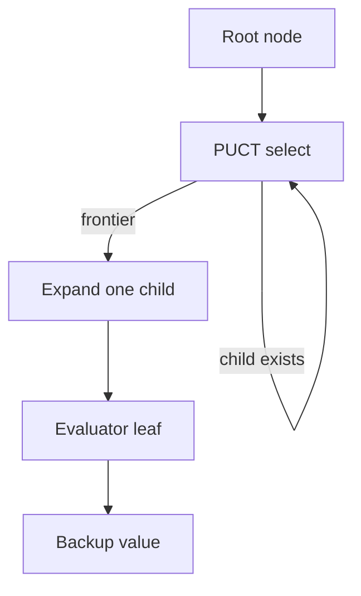

# Implementation Blueprint

Module: `github.com/DevomB/gofer` | Rules v1: **Chinese** | Paper reference: arXiv:1902.10565

---

## 1. Project Goals

### Long-term vision
A serious Go engine in idiomatic Go: rules-correct, search-strong, optionally neural-guided, benchmark-driven, with self-play/training hooks — inspired by Stockfish-style engineering discipline and KataGo-style ML architecture (without copying KataGo code).

### Near-term deliverables
- 10 planning docs complete
- M0 repository foundation
- M1 Chinese-rules board engine with undo, tests, benchmarks
- Tectonix `quality_signal` ≥ 9000 at repo root before release

> **Architecture note (2026-06):** v1 ships as monolithic `cmd/gofer` (`package main`) with zero cross-package import edges. Milestones M1–M10 live there (not `cmd/engine` / `internal/*`). An earlier `internal/*` split was reverted after Tectonix modularity regressions; only `cmd/bench` is separate (exec-based, no import of gofer).

### Explicit non-goals (v1)
- Neural network training or GPU inference in-process
- KataGo-level strength without trained NN
- Full JSON analysis API (post-paper, v2+)

**v1.0 (2026-06):** GTP, MCTS, SGF export, terminal play/analyze/watch, self-play samples.

**v2.0 (2026-06):** Optimized `LegalMoves` (7 allocs/op), arena CLI with Wilson CI + config hash, sample schema v1 (JSONL), SE-4 search mechanisms (mixed caps, forced root, policy pruning), batched mock inference (`features.go`, `BatchedEvaluator`), ownership labels for training export. ADRs in `docs/decisions/`. Scorecard composite **7/10**. ONNX inference deferred to v2.5.

---

## 2. Engine Modes

| Mode | Description | Milestone |
|------|-------------|-----------|
| **rules-only** | Legal moves, play, score — no search | M1 |
| **search-only** | MCTS with uniform/heuristic leaf | M4–M5 |
| **heuristic evaluator** | Hand-tuned eval for search | M7 |
| **neural-guided** | NN prior/value via `eval` | M11 |
| **analysis** | Deep eval + PV for positions | M8+ |
| **self-play generator** | Games → training samples | M10 |
| **benchmark** | `cmd/bench` + regression | M9 |

---

## 3. Milestone Ladder

### M0: Repository foundation
- **Objective:** Compilable module, CI-friendly Makefile, package skeleton
- **Acceptance:** `go build ./...`, `go test ./...` pass (may be empty tests)
- **Tests:** smoke test in `board` package
- **Benchmarks:** skeleton `BenchmarkBoardAt` in `board`
- **Bottlenecks:** N/A
- **DoD:** `go.mod`, Makefile, `.tectonix/rules.toml`, `cmd/gofer` skeleton

### M1: Rules-correct board engine (Chinese)
- **Objective:** Place/capture/ko/score/undo on 19×19
- **Acceptance:** golden tests pass; simple ko enforced; suicide allowed only if capturing
- **Tests:** table-driven legality, capture, ko, scoring; 3+ golden positions
- **Benchmarks:** MakeMove, Undo, LegalMoves, HashUpdate
- **Bottlenecks:** naive liberty scan
- **DoD:** `cmd/gofer` Chinese rules complete for standard play

### M2: Tromp-Taylor + superko + SGF replay
- **Objective:** Second ruleset; SGF import validates engine moves
- **Acceptance:** SGF corpus replays without mismatch
- **Tests:** SGF replay tests in `cmd/gofer`
- **Benchmarks:** SGF replay throughput
- **DoD:** `cmd/gofer` tromp rules; positional ko option

### M3: Fast state mutation
- **Objective:** Incremental groups OR proven undo faster than copy
- **Acceptance:** bench shows ≥2× MakeMove vs M1 naive OR documented shortcut with bench evidence
- **Benchmarks:** clone vs undo comparison
- **DoD:** decision log entry for board repr

### M4: Search skeleton
- **Objective:** Selection/expansion/backup without NN
- **Tests:** fixed-seed tree shape tests
- **Benchmarks:** single playout iteration
- **DoD:** `cmd/gofer` search + tree arena

### M5: Basic MCTS/PUCT
- **Objective:** PUCT with heuristic eval; root Dirichlet noise optional
- **Tests:** visit count monotonicity; symmetry on empty board
- **Benchmarks:** selection step, expansion, full playout
- **DoD:** matches paper PUCT formula (c_PUCT=1.1)

### M6: Transposition table
- **Objective:** Zobrist-keyed TT; graph-search compatibility research
- **Benchmarks:** TT hit rate on repeated subtrees
- **DoD:** measurable hit rate on ladder/capture fixtures

### M7: Evaluator abstraction
- **Objective:** `eval.Evaluator` + heuristic + mock
- **Benchmarks:** eval call overhead, batch throughput stub
- **DoD:** search uses interface only at boundary

### M8: Protocol support
- **Objective:** GTP 2.x core commands; analysis CLI stub
- **Tests:** GTP command parsing
- **Benchmarks:** GTP parse throughput
- **DoD:** `genmove`, `play`, `boardsize`, `komi`

### M9: Benchmark suite
- **Objective:** `cmd/bench` runs all benches; optional regression JSON
- **DoD:** Makefile `bench`, `profile` targets work

### M10: Self-play data generation
- **Objective:** playout cap randomization; sample export schema
- **DoD:** writes JSON/flat samples from self-play

### M11: Model integration
- **Objective:** inference adapter; batched eval worker
- **DoD:** engine runs with external ONNX or mock weights

### M12: Optimization passes
- **Objective:** PGO build, escape analysis fixes, concurrency tuning
- **DoD:** documented before/after profiles; scorecard ≥6

---

## 4. Repository Layout

```
gofer/
├── cmd/gofer/           # monolithic engine binary (rules, MCTS, GTP, CLI)
├── cmd/bench/           # M9 benchmark regression runner
├── docs/
├── .tectonix/rules.toml
├── Makefile
├── go.mod
└── README.md
```

> v1 intentionally keeps all engine code in `cmd/gofer` as `package main`. The `internal/*` layout below was the original target; defer split until post-v1 if needed.

```
gofer/  (post-v1 option)
├── cmd/gofer/
├── internal/
│   ├── board/
│   ├── rules/
│   ├── search/
│   └── ...
```

---

## 5. Package Contracts

> Implemented in `cmd/gofer` as plain types and files (not separate packages). Contracts below describe logical boundaries.

### `board` (`cmd/gofer/board.go`, `move.go`, `point.go`, `zobrist.go`)
- **Responsibilities:** Coordinates, `Move`, `Board` grid, `Side`, Zobrist, undo stack
- **Must NOT:** rule legality, scoring logic
- **Public API:** `New(size)`, `At(c)`, `Play(m)` via rules only — board exposes mutation primitives
- **Hot path:** `SetStone`, `RemoveStone`, `Hash`, undo push/pop
- **Tests:** coord round-trip, hash determinism

### `rules` (`cmd/gofer/chinese_rules.go`, `tromp_rules.go`, `superko.go`)
- **Responsibilities:** `Ruleset` — `LegalMoves`, `Play`, `Score`, `Result`
- **Must NOT:** MCTS, GTP parsing
- **API:** `type Ruleset interface { ... }` at package root; implementations in subpackages
- **Hot path:** `LegalMoves` — known shortcuts ok if benchmarked
- **Tests:** per-ruleset golden files

### `search` (`cmd/gofer/mcts.go`, `arena.go`, `tt.go`)
- **Responsibilities:** MCTS driver, PUCT, root noise, pruning hooks
- **Must NOT:** import `training`, `model` weights
- **API:** `Search(board, eval, cfg) Move`
- **Hot path:** `Select`, `Expand`, `Backup` — no interface dispatch in inner loop
- **Tests:** seeded RNG tree tests

### `eval` (`cmd/gofer/evaluator.go`, `inference.go`)
- **Responsibilities:** `Evaluator` interface, heuristic, mock
- **Must NOT:** board mutation
- **API:** `Evaluate(pos) (policy, value, err)`
- **Hot path:** batch API separate from single-pos interface

### `gtp` (`cmd/gofer/gtp.go`)
- **Responsibilities:** stdin/stdout protocol
- **Must NOT:** search internals

---

## 6. Board Representation Options

| Option | Go fit | Search fit | Verdict |
|--------|--------|------------|---------|
| **Mutable + undo** | Excellent — slice stack | Best for MCTS | **Default [GOFER]** |
| Copy-make | Simple, idiomatic | Alloc-heavy | Benchmark vs undo |
| Immutable persistent | Functional style | Poor GC pressure | Reject for v1 |
| Bitboards | Less natural in Go | Good for 19×19 masks | Optional later for legality masks |
| Union-find groups | Standard | Speeds capture | M3 candidate |

**Zobrist:** `uint64` per (cell, color, komi bucket); increment on change.

**Superko v1:** simple ko only; hash+ko-ban point in undo record.

---

## 7. Search Architecture



- **Node:** `VisitCount`, `ValueSum`, `Prior`, `Children []child` or index arena
- **Root:** noise blend, forced playouts, pruning on target export only
- **Concurrency:** virtual loss optional M5+; benchmark before enabling
- **Tree reuse:** retain tree on same position (GTP) — M8
- **TT:** separate from node tree — M6

---

## 8. Evaluation Layer

```go
type Evaluator interface {
    Evaluate(ctx context.Context, pos Position) (EvalResult, error)
}
```

- `HeuristicEvaluator` — material/territory proxy for M7
- `MockEvaluator` — fixed policy/value for tests
- `BatchedEvaluator` — wraps remote/ONNX with queue (M11)
- Hot path: concrete type in search loop; interface at construction only

---

## 9. Protocols And Tooling

| Protocol | Priority | Location |
|----------|----------|----------|
| GTP 2.x | M8 | `cmd/gofer/gtp.go` |
| JSON analysis | M8+ post-paper | deferred |
| SGF import/export | M2 | `cmd/gofer/sgf.go`, `sgf_parse.go` |
| `cmd/bench` | M9 | `cmd/bench` |
| self-play CLI | M10 | `cmd/gofer -selfplay` |

Makefile targets: `test`, `bench`, `race`, `lint`, `profile`, `pgo-build`, `selfplay`, `analyze`

---

## 10. Test Strategy

- **Unit:** table-driven for rules, coords, hash
- **Property:** legality ⊂ board empty or capture; hash collision spot checks
- **Golden:** known positions from testdata
- **SGF replay:** moves match reference (M2)
- **Regression:** bench JSON compare (M9)
- **Seeds:** `rand.NewSource(0)` in search tests

---

## 11. Performance Strategy

### Microbenchmarks
`go test -bench=. -benchmem ./cmd/gofer/...`

### Macrobenchmarks
Full game playout, GTP session replay (M9)

### pprof
```bash
go test -cpuprofile=cpu.prof -bench=BenchmarkLegalMoves -benchtime=3s ./cmd/gofer/
go tool pprof -top cpu.prof
```

### PGO
```bash
make pgo-profile   # writes default.pgo
make pgo-build     # go build -pgo=default.pgo -o bin/gofer ./cmd/gofer
```
Refresh when hot paths change. Microbench-only profiles can mislead — use representative mix.

### Build tags
`//go:build debug` for expensive assertions only in dev

---

## 12. Decision Log Format

Store in `docs/decisions/NNNN-title.md`:

```markdown
# Title
## Context
## Options
## Decision
## Why
## Performance impact
## Revisit trigger
```

Example triggers: bench regression >5%; new ruleset; MCTS parallelism added.
